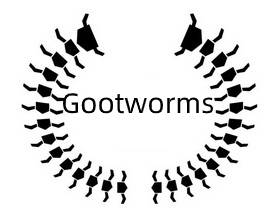

<p align="center">
  <a href="" rel="noopener">
 </a>
</p>

<h3 align="center">Gootworms</h3>

<div align="center">

[]()
[](https://github.com/kylelobo/The-Documentation-Compendium/issues)
[](https://github.com/kylelobo/The-Documentation-Compendium/pulls)
[](/LICENSE)

</div>

---

<p align="center"> Few lines describing your project.
    <br> 
</p>

## 📝 Table of Contents

- [About](#about)
- [Getting Started](#getting_started)
- [Usage](#usage)
- [Built Using](#built_using)
- [TODO](./TODO.md)
- [Contributing](../CONTRIBUTING.md)
- [Authors](#authors)
- [Acknowledgments](#acknowledgement)

## 🧐 About <a name = "about"></a>
这是一个用golang编写的主从分布式爬虫

## 🏁 Getting Started <a name = "getting_started"></a>

通过Dockerfile部署好生产环境后即可使用(目前还处于开发阶段，Dockerfile还没最终配置好)

### Prerequisites

启动分为从节点(worker)和主节点(master)两种模式。开启redis-server和mongodb服务，且先启动主节点，再启动从节点


主节点启动
```
go run main master
```

从节点启动
```
go run main worker
```


### Installing

通Dockerfile在docker中安装环境(需先安装docker)(目前还处于开发阶段，Dockerfile还未配置好)

```
Give the example
```

And repeat

```
until finished
```

End with an example of getting some data out of the system or using it for a little demo.


## 🎈 Usage <a name="usage"></a>

这个是本人的golang练习项目,供学习交流，欢迎讨论

## ⛏️ Built Using <a name = "built_using"></a>

- [MongoDB](https://www.mongodb.com/) - 存储数据库
- [Redis](https://expressjs.com/) - 节点RPC通信依赖
- [golang](https://vuejs.org/) - 开发语言


## ✍️ Authors <a name = "authors"></a>

- [@RockyHoo1209](https://github.com/RockyHoo1209) - Idea & Initial work
欢迎讨论和交流,qq:1284219022@qq.com

## 🎉 Acknowledgements <a name = "acknowledgement"></a>

- Hat tip to anyone whose code was used
- Inspiration
- References
